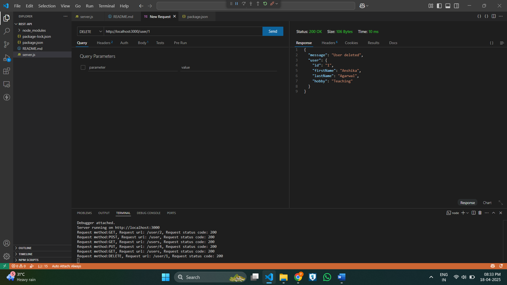

extract files from zip folder or clone the project from github.

github link : https://github.com/prudhvi-marada/REST_API.git

Run `npm install` to install dependencies.

start the server using command: npm start

now the server is running at  : Server running on http://localhost:3000 

REST Api's testing by Thunder Client: (for better Readable see in my github link given above )

--> Testing GET METHOD:  ( http://localhost:3000/users )
   
   

-->Testing GET by user id: (eg: http://localhost:3000/user/2)

  

-->Testing Post Method :  (http://localhost:3000/user)

   

--> After Testing Post Method Get data to observe by Get Method: ( http://localhost:3000/users )

  

--> Testing PUT method:  (eg:  http://localhost:3000/user/4 )

 

--> After Testing PUT Method Get data to observe by Get Method:  ( http://localhost:3000/users )

  

-->Testing DELETE method:  (eg: http://localhost:3000/user/4)

 

-->After Testing DELETE Method Get data to observe by Get Method:  ( http://localhost:3000/users )

 

--> Testing validateBody Middleware by entering miss field data:

 
